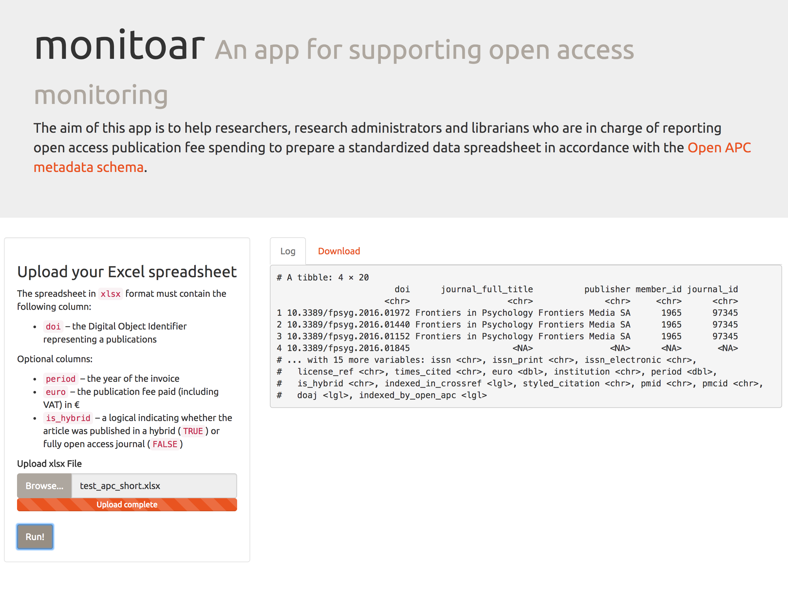

## monitoar - prototyping a shiny app for easy open access monitoring



### Running the app locally

```{r}
library(shiny)
runGitHub( "monitoar", "njahn82") 
```

### Credits

- [Shiny](https://shiny.rstudio.com)
- [rcrossref](https://github.com/ropensci/rcrossref)
- [Open APC initiative](https://github.com/openapc/openapc-de)